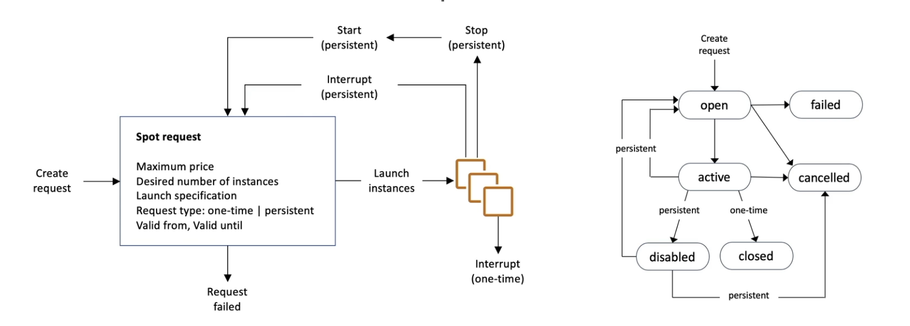

## EC2
  - Stands for Elastic Compute Cloud.
  - Available OSs: Linux, Windows, Mac OS.
  - We can use a bootstrap script to run when the machine starts. It runs with root user privileges.
  - Private IP will be same for the same instance, but Public IP may change after restarts.
  - Elastic IP provides static IP for the instance.
  - Naming convention is <instance class><generation>.<size>. For example: m5.2xlarge.

## EC2 Instance Types
  - General Purpose
  - Compute Optimized
  - Memory Optimized
  - Accelerated Computing
  - Storage Optimized
  - HPC Optimized
  - Instance Features
  - Measuring Instance Performance

## Purchasing Options
  - On-demand: Short workload, predictable pricing, pay by second
  - Reserved: 1 or 3 years. For long workloads. A specific combination of instance type, region, scope, tenancy
    and OS is reserved or Convertible Reserved Instance allows changing instance type.
  - Savings Plans: 1 or 3 years. For long workloads. Commitment to an amount of usage instead of instance type.
    Locked to a specific instance family and region.
  - Spot instances: For very short workloads. Cheap. Can go anytime. We can set a max price under which we can
    continue to use spot instance. In case current spot price is higher than specified max price, we lose the
    spot instance.
  - Dedicated hosts: Booking an entire physical server. Pricing based on either on-demand or reserved. Can be 
    needed due to regulation or license requirements. Allows access to hardware details on lower levels. There
    is Reserved Dedicated Host option as well which is cheaper.
  - Dedicated instances: Using instances on dedicated hardware. Others can't share the same hardware. No access
    to hardware details on lower levels.
  - Capacity reservations: Reserving capacity in any AZ for any duration.

## Spot Instance Requests/Termination
  - We can create a spot request by defining max price, desired number of instances, launch specification, request
  type and in case request type is persistent we should define a validation period. In case it is one-time request
  no need to define a validation period.
  - If request type is persistent, AWS will try to meet the request conditions in the defined validation period.
  - If we want to get rid of instances, first we should cancel the request. Otherwise instances will created again,
  because request is still valid.

## Spot Fleets
  - It is for cost savings.
  - Consists of spot instances and optional on-demand instances. 
  - Will try to meet target capacity with price constraints.
  - Possible launch pools are defined based on instance types, OS, AZ. Fleet will choose the most appropriate pool.
  - When fleet reaches to desired capacity or max cost, it stops launching instances.
  - There are strategies for the fleet:
      - lowestPrice: Fleet starts instances from the pool with lowest price.
      - diversified: Instances distributed over all defined pools. Better availability.
      - priceCapacityOptimized: First chooses the pools with highest capacity available, then chooses based on lower
      cost.

## Placement Groups
  - It's for controlling placement of instances on AWS infrastructure.
  - One of the strategies must be chosen: Cluster,
  - Cluster strategy places instances in a low-latency group in the same AZ. High performance and high risk.
  - Spread strategy spreads instances across infrastructure. Max 7 instances for per group in per AZ. Less risky.
  Suitable for critical applications.
  - Partition spreads instances across different partitions on different racks in the same AZ across multiple AZs. 
  Allows 100s of instances per group, but 7 partitions per AZ. Suitable for distributed big data tools such as
  Cassandra, Hadoop, Spark, Kafka.

## Hibernate
  - In case we hibernate the instance, RAM content will be written to an EBS volume. When instance spinned up again,
  It'll continue with same RAM content. It allows fast booting.
  - Root volume must be an EBS and encrypted.