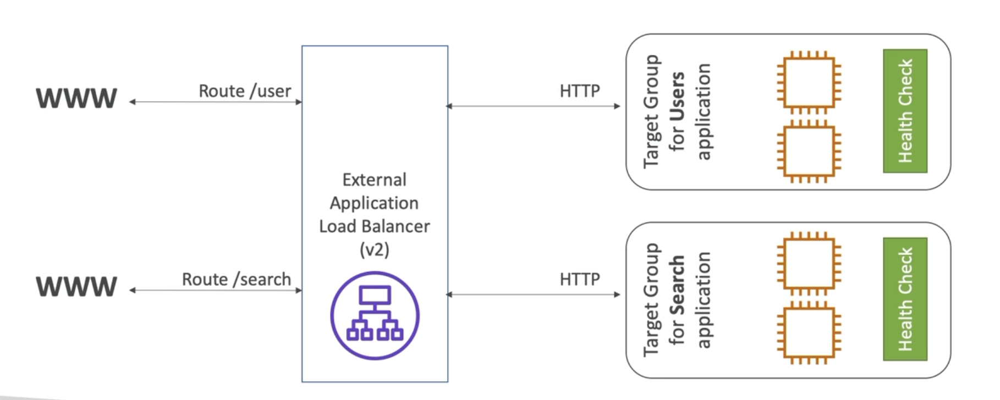
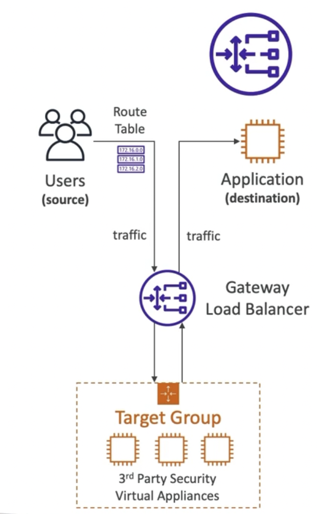

## ELB
- Stands for Elastic Load Balancer.
- It's a managed service that is in front of multiple servers and spread load across them.
- Scoped to multi-AZ setup in the same region.
- It can provide a single point access to an application run across multiple servers.
- It can seamlessly handle failures of downstream instances by forwarding traffic to instance that are working.
- It can do healtcheck for the downstream instances, provide SSL termination, provide sticky sessions with cookies, provide high availability across zones, separate public traffic from private traffic.
- Some load balancers can be set internal(private) or external(public).
- There are 4 types of load balancers:
    - Classic Load Balancer: Deprecated.
    - Application Load Balancer: Supports HTTP, HTTPs, WebSocket.
    - Network Load Balancer: TCP, TLS, UDP
    - Gateway Load Balancer: Operates at layer 3.

## ALB
- Stands for Application Load Balancer.
- Works in layer 7(HTTP).
- Allows load balancing across multiple machines or multiple containers in a single machine.
- Supports HTTP/2, WebSocket and automatic HTTP/HTTPS redirection.
- Supports routing via routing tables to multiple target groups via hostnames, different paths in the same host, query strings, or headers.
- Target groups can be EC2 instances, ECS tasks, Lambda functions or private IP addresses.
- One load balancer can be used for multiple applications.
- We can add rules to control inbound traffic to ALB to cconditionally take action/redirect the traffic. For example filtering based on a header value.

## NLB
- Stands for Network Load Balancer.
- Works in layer 4. Forwards TCP, UDP traffic.
- High performance. Can handle millions of requests per second. Low latency.
- Have one static IP per AZ. Can have Elastic IP.
- Target groups can be EC2 instances, Private IPs, ALB, 
- Healt checks can be done via HTTP, HTTPS or TCP.

## GWLB
- Stands for Gateway Load Balancer.
- Operates at layer 3.
- Used to deploy, scale and manage 3rd party network tools, firewalls etc.
- Uses GENEVE protocol on port 6081.

## Sticky Sessions
- Instead of spreading traffic across all the instances, traffic goes to the same instance if there is a session.
- Works for ALB and NLB. For ALB, a cookie is used for session expiration.
- Cookie can be user-application generated or load balancer generated. Load balancer generated one can be application cookie or duration-based cookie.
- It is configured in target groups in AWS console.

## Cross-Zone Load Balancing
- Allows distributing load across AZs evenly.
- Without cross-zone load balancing, traffic is distributed evenly in same AZ. It causes some instances to have more traffic if number of instances across AZs are imbalanced.
- Its the behaviour by default in ALB. 
- Can be configured in target groups.
- Disable by default for NLB and GWLB. It'll be charged in case it is enabled.

## SSL/TLS
- Traffic between users and load-balancer uses HTTPS, but in load-balancer TLS is terminated. Traffic between load-balancer and instances uses HTTP over private network.
- A listener must be set in the load-balancer to specify the protocol, port and the certificate:
    - A default certificate must be specified.
    - An optional list of certificates can be speficied to support multiple domains.
    - Client can use SNI(Server Name Indication) to specify the hostname they want to reach.
    - Provides ability to support older SSL/TLS versions via specifying a security policy.
- In newer versions of protocol, client should indicate the hostname to connect in initial handshaking. It is called SNI extension. Thanks to it server can load the certificate
required by the indicated hostname, thus can serve multiple certificates for multiple websites.
- SNI supported by ALB and NLB.

## De-registration Delay
- It is time to complete incoming requests when instance is de-registering or unhealthy.
- Current requests are given a time period to complete, new connections to the instance won't be created.