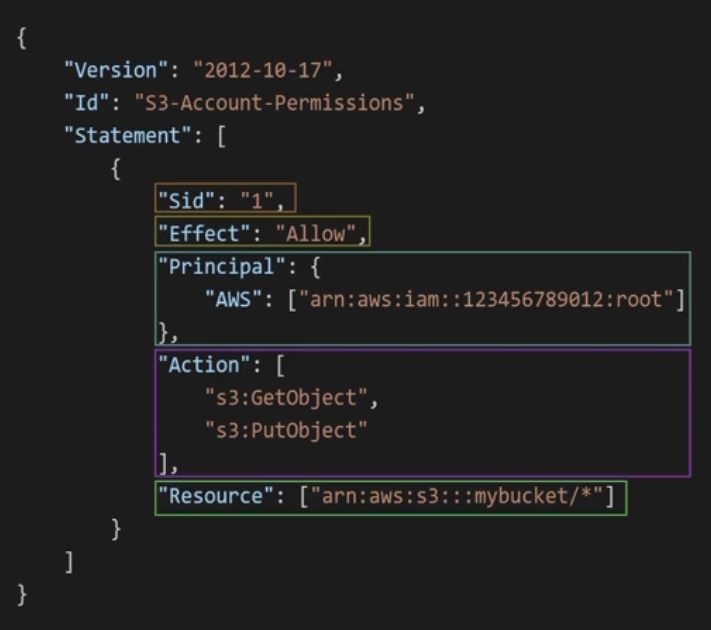

## IAM
    - Stands for Identity and Access Management.
    - Global service.
    - Root account shouldn't be used or shared. Instead, users should be used and granted with least required privilege.
    - Users can be grouped together and can be assigned multiple groups.
    - Groups only contain users, can't contain other groups.
    - Users or groups can be assigned policies.

## Policies
    - An example policy is given below.
    - Each policy has a language version.
    - Each policy has an optional ID for identifying them.
    - Statements contains one or more objects.
    - Each statement has an optional Sid field for identifying them.
    - Effect defines whether usage/access is allowed or denied.
    - Principal is the account, user or role to which policy is applied.
    - Action is the actions this policy is concerned.
    - Resource is the list of resources to which actions are applied.
    - There is also an optional condition part which determines when this policy will be in effect.

## Roles
    - We use roles to control permissions of AWS services which acts on behalf of the account.

## Security
    - We can define a password policy to enforce more secure password usage.
    - We can enforce MFA, too achieve more secure account. We can set a virtual MFA device such as
      Google Authenticator or Authy. There is also Universal 2nd Factor Security Key which is a physical device.
      There are also Hardware Key Fob MFA Devices which are physical devices as well.
    - For auditing purposes we can use IAM Credentials Report and IAM Access Advisor.