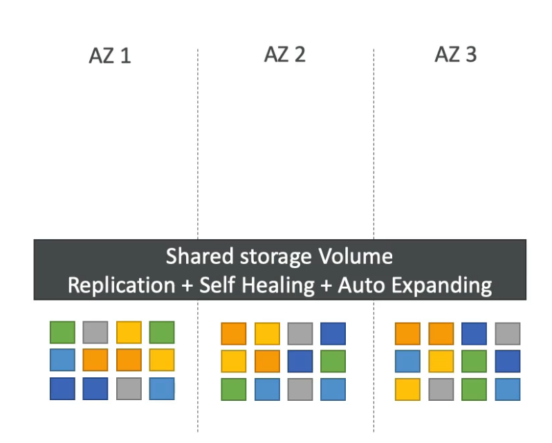
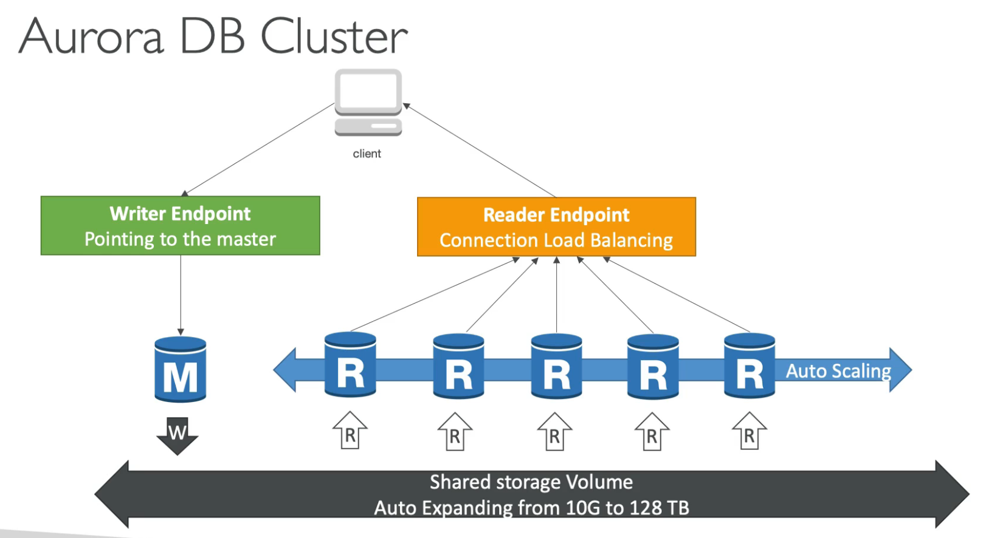

    Main features:
        - Aurora is a proprietary technology from AWS.
        - Postgres and MySQL are supported as Aurora database.
        - It is cloud optimized databse service and have performance
        improvements on Postgres and MySQL on RDS.
        - Its storage automatically grows up to 128 TB in increments
        of 10 GB.
        - It can have up to 15 read replicas and replication process
        is faster.
        - Failover is istantenous.
        - Offers built-in high availability.
        - Although expensive than RDS, it is more efficient.

    High Availability and Read Scaling:
        - Maintains 6 copies of data across 3 AZs:
            - 4 copy is used for writes.
            - 3 copy is used for reads.
        - Self healing with peer-to-peer replication if data is
          corrupted.
        - Storage is distributed across hundreds of volumes which
          is maintained by AWS.
        - One instance called master is responsible for writes.
        - In case of an issue failover for master takes less than
          30 seconds on average.
        - It can hane 15 read replicas besides master and replicas
          supports cross region replication.
        - An writer endpoints points to master, so nothing changes
          from client point of view.
        - Read replicas can be auto-scaled. To make communication
          easier for the client there is a reader endpoint which
          load balances across available read replicas.
