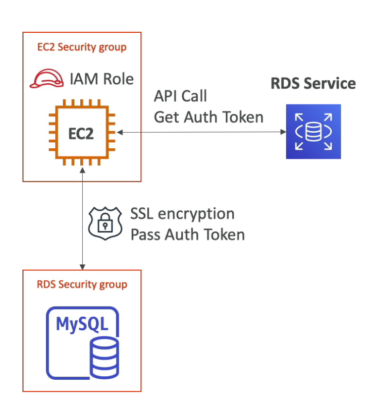

    RDS stands for Relational Database Service. It's an managed DB service offered by AWS.
    Supported engines are: Postgres, MySQL, MariaDB, Oracle, Microsoft SQL Server, Aurora.
    AWS doesn't allow users to make SSH connections, manual DB patching, manual OS patching,
    audit underlying infrastructure.

    Pros of using RDS:
      - Automated provisioning
      - OS patching
      - Continuous backups and restoring from a specific timestamp
      - Monitoring
      - Read replicas for improved read performance
      - Multi AZ setup for disaster recovery
      - Maintenance windows for upgrades
      - Storage auto scaling. If RDS detects that the DB is running out of storage it
        scales automatically. User also should set a maximum storage threshold. Automatic
        scaling can also work with such rules: free storage is less than %10 of allocated
        storage, lost-storage lasts at least 5 minutes, 6 hours passed since last change.
           
    Cons of using RDS:
      - SSH is not allowed into instances

    Backups:
      - Backups are automatically enabled in RDS

        Automated backups:
          - Daily full backup of the database in maintenance window
          - Transaction logs are backed up every 5 minutes
          - 7 days retention by default but can be increased to 35

        DB Snapshots:
          - Manually triggered by the user
          - Retention is as long as user wants

    Read replicas:
      - It's for to scale read operations.
      - Up to 5 replicas can be created.
      - Replicas can be within AZ, cross AZ or cross region.
      - Replication is asynchronous replication, so if data is read before the 
        replication it can serve old data. Because of that, it is called eventually
        consistent replication.
      - Replicas can be promoted to a different database. In this case it is out
        of replication and lives in its own life cycle.
      - No cost for network bandwith if AZs are in the same region.

    Disaster Recovery:
      - Synchronous replication to a standby instance in different AZ. Every single
        change in master is replicated to standby db. 
      - One DNS is used, so if master DB has some problems load is assumed by
        standby database to increase availability and standby database is promoted
        to be master database.
      - Standby DB is just for disaster recovery not for scaling, but read replicas
        can be set in different AZs for disaster recovery. 
      - Going from single-AZ to multi-AZ doesn't require downtime. First a snapshot
        is taken from the main database. The snapshot is used to restore a stand by
        database in a different AZ. Finally synchronization is established between
        databases. 

    Security:
      - At rest encryption:
        - Data can be encrypted at rest by using AWS KMS(Key Management System).
        - Encryption has to be defined at launch time.
        - If master is not encrypted then read replicas also can't be encrypted.

      - In-flight encryption:
        - SSL certificates are used to encrypt data that in network traffic
      
      - Encrypting Backups
        - If database is not ecrypted then snapshot is not encrypted and vice versa.
        - Although snapshot is unencrypted, an encrypted version can be created by
          copying it. It's also the way to encrypt an unencrypted RDS database.

      - Network security:
        - RDS databases are usually deployed in private subnets.
        - Network traffic is controlled by security groups as it is the case with
          EC2.
        
      - Access management:
        - IAM policies are used to give control on RDS database management.
        - Traditional DB users are used to log into database and for MySQL and
          PostgreSQL IAM authentication also can be used for logging into db
          by obtaining a token from IAM.

      
    
