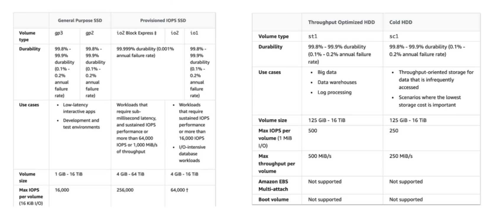

    EBS volume:
        - An EBS(Elastic Block Store) volume is a block-level storage that emulates traditional
          block devices such as physical hard drives. It is a form of network attached storage.
        - Long term storage. Data in an EBS volume is persisted even after termination
        - They are bound to a specific availability zone(for example if an EBS volume is created
          in us-east-1a, it can't be attached to us-east-1b, but a snapshot can be taken to move
          data to another AZ)
        - Latency might occur because it is not a physical drive but a network drive
        - Their capacity is measured in GBs and IOPS.
        - Capacity of the drive can be increased over time.
        - By default the root EBS volume is deleted on termination, other volumes are not. It is 
          an configurable behaviour.

    EBS volume types:
        - gp2/gp3 (SSD): General purpose SSD volume with a balance between cost and performance.
          Size and IOPS tied together. Increasing size increases IOPS as well.
        - io1/io2 (SSD): Highest performance SSD volume for low latency or high-throughput 
          workloads. Allows independently increasing Size or IOPS and has multi-attach feature
        - st1 (HDD): Low cost HDD volume for workloads that need frequent access and high 
          throughput
        - sc1 (HDD: Lowest cost HDD volume which is designed for workloads that need less frequent
          access

    EBS volume types use cases:
        - General purpose SSD:
            - Cost effective
            - Low-latency
            - System boot volumes, virtual desktops, dev/test environments
            - EBS types: gp2, gp3
        - provisioned IOPS SSD: 
            - Performance intensive, business-critical applications.
            - Databases
            - EBS types: io1/io2, io2 block express
            - Supports multi-attach
        HDD:
            - Can't be boot volumes
            - types: st1, sc1
            - st1 is throghput optimized, use cases are: big data, data warehouses,
              log processing
            - sc1 is cold hdd, has lowest cost, use cases are: infrequently accessed data such
              as archives

    Snapshots:
        - Also called backup
        - They can be copied across AZs or Regions, so if we want to copy content of an EBS in a
          AZ or region to another one, we can use snapshots
        - Snapshots can be put into archive tier which is much cheaper, but restoring content
          from archives is also time consuming.
        - To prevent accidentally deleting snapshots, a recycle bin can be created to preserve
          snapshots even after deletion for a specified period. 

    AMI:
        - Stands for Amazon Machine Image
        - AMI are built for a specific region, but can be copied into other regions
        - We can create our own AMIs. One way is customizing an EC2 instance and building an AMI.
          This process also creates an EBS
    
    EC2 Instance Store:
        - Because EBS is a network drive it might not be sufficient for some use cases
        - It is a hardware device attached to an EC2 instance
        - Better I/O performance
        - They are ephemeral volumes, so whenever instance is stopped they are gone
        - Because it is ephimeral, it is good to use as buffer, cache, or temporary content
        - Any failure in hardware can cause data loss
    
    EFS:
        - Stands for Elastic File System
        - It's a managed NFS that can be mounted to multiple EC2 instances in multiple AZs
        - Highly available, scalable and expensive. Scales automatically
        - Pay per use
        - Use cases: content management, web serving, data sharing
        - Only compatible with Linux based AMIs
        - Encryption at rest via KMS
        
    EFS modes:
        - Performance mode:
            - General purpose: latency-sensitive use cases(web server, CMS)
            - Max I/O: higher latency, throughput, highly parallel(big data)
        - Throughput mode:
            - Bursting: Depends on size
            - Provisioned: Throughput is flexible regardless size

    EFS storage classes:
        - Storage tiers:
            - standard: For frequently accessed files
            - infrequent access(efs-ia): Retrieving files are slower, price is lower.
              Enabled with a Lifecycle policy, so whenever a file has no access more
              than specified period, it is moved to efs-ia tier.

        Availability and durability:
            - regional:
                - multi-az: good for prod
                - one zone: good for development, backup is enabled by default, compatible
                  with efs-ia.
                - Great cost savings