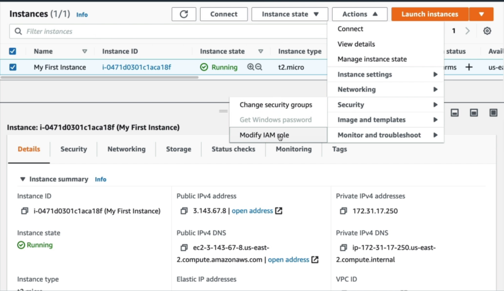
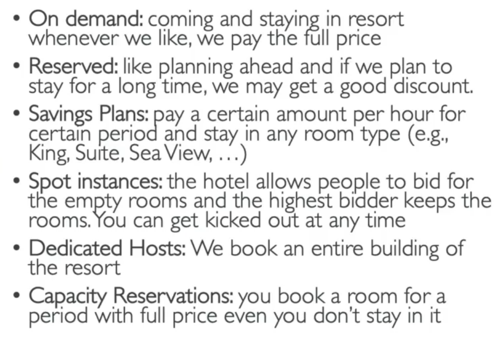

    EC2 stands for Elastic Compute Cloud and it is an infrastructure as a service. Some capabilities of EC2 are:
        - Renting virtual machines (EC2)
        - Storing data on virtual drives (EBS)
        - Distributing load across machines (ELB)
        - Scaling services via auto-scaling group (ASG)
    
    Some of the configurations we can choose for EC2 instances:
        - OS: Linux, Windows, MacOS
        - Compute power & cores
        - RAM
        - Storage: network attached(EBS, EFS), hardware(EC2 instance store)
        - Network: network card speed, public ip
        - Firewall rules: security group
        - EC2 User Data which is a bootstrap script

    There are several different EC2 instance types which are optimized for different things:
        - General Purpose
        - Compute Optimized
        - Memory Optimized
        - Accelerated Computing
        - Storage Optimized

    Naming convention for an EC instance is: m5.2xlarge. In this convention:
        - m: instance class
        - 5: generation
        - 2xlarge: size within the instance class

    To compare all different EC2 instances: https://instances.vantage.sh

    Security groups are fundamental means for network security in AWS. They act as a firewall by controlling how
    traffic is allowed into or out of our EC2 instances. Some of their functionality is:
        - Controls inbound traffic(from other to EC2 instance)
        - Controls outbound traffic(from EC2 istance to other)
        - Port access
        - Authorised IP ranges

    A security group can be attached to multiple EC2 instances and one EC2 instance can have multiple security
    groups. They are valid in a region/VPC combination. By default all inbound traffic is blocked and all outbound
    traffic is authorised. 

    By authorizing other security groups in a security group we can provide access to EC2 instance without explicitly
    stating IP addresses. 

    Some useful ports:
        - 21: FTP
        - 22: SSH, SFTP
        - 80: HTTP
        - 443: HTTPS
        - 3389: RDP

    If we need to use AWS services from EC2 instances, we should create roles instead of typing secrets in terminal
    for configuration which can cause security problems, because some another user in the same account might get this
    secrets. We can attach a role to an EC2 instance by using instances page:

    EC2 Instance Purchasing Options:
        - On-demand instances: 
            - short workload
            - predictable pricing
            - pay for what you use
            - Linux/Windows is billed per seconds, other OS is billed per hour

        - Reserved(1 & 3 years): 
            - discounted price compared to on-demand
            - reserving a specific instance attribute such as instance type, region, tenancy, os etc.
            - Reserved instances: long workloads(database etc)
            - Convertible reserved instances: long workloads with flexible instances(allow change for example instance type)
        
        - Savings plan(1 & 3 years): 
            - Commitment to a certain type of usage such as $10/hour for one year
            - usage that is more than the plan is billed at on-demand price
            - Locked to a specific instance type and AWS region
            - Long workloads
            - Instance size, OS and tenancy are flexible
        
        - Spot instances: 
            - Short workloads
            - Cheap
            - Instance might be lost anytime if determined max prices is exceeded by current spot price
            - Suitable for not critical, resilient workloads
        
        - Dedicated hosts: 
            - Booking and access to physical server
            - Control on instance placement
            - Capacity fully dedicated to user
            - Billed on-demand or reserved
            - Useful to meet regulation and compliance needs
            - Visibility of low-level hardware such as sockets, cores, host ID

        - Dedicated instances: 
            - Hardware dedicated to only one user
            - No control on instance placement
            - Hardware may shared with other instances in the same account

        - Capacity reservations: 
            - Reserving on-demand instance capacity in a specific AZ for any duration
            - EC2 capacity is always accessible when it is needed
            - No time commitment, no billing discounts
            - To benefit from discounts it can be combined with regional reserved instances and Savings Plans
            - Charging at on-demand no matter instances are running or not
            - Suitable for short-term, uninterrupted workloads that needs to be in a specific AZ

                       