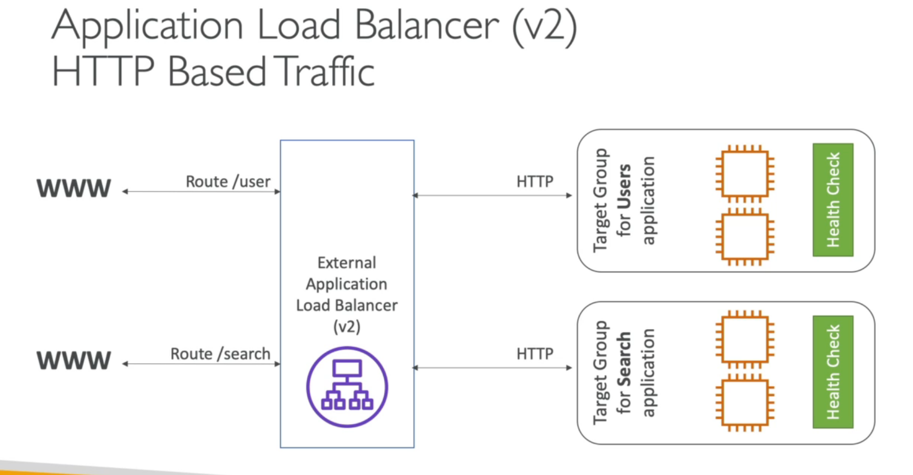
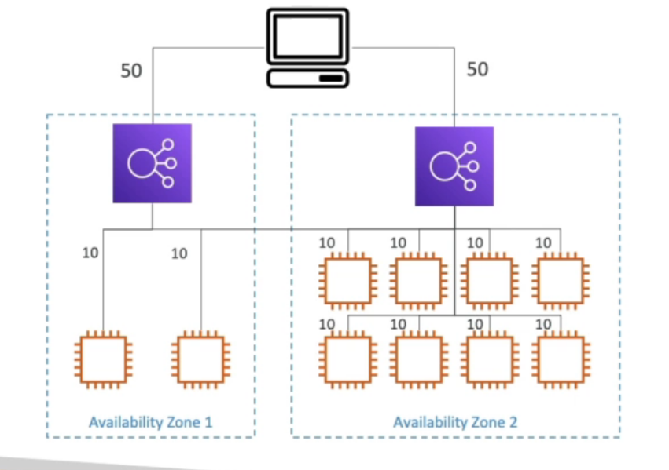

    Terms:
        Vertical scaling: Increasing resources of an instance/instances.
        Horizontal scaling: Increasing number of instances. ASG, LB.
        High-availability: In AWS context it means running same application in
        different AZs to be resilient to a data center loss. Multi AZ ASG, Multi
        AZ LB.

    ELB:
        - Load balancers distributes load across servers. It acts as a reverse 
          proxy.
        - Benefits: Spreading load across multiple downstream instances, exposing
          a single point of access to the application via DNS, handling failures
          of downstream instances, SSL termination, caching, high-availability
          across zones, separating public traffic from private traffic.
        - ELB stands for Elastic Load Balancer and it's a managed load balancer.
          Upgrades, maintenance, details are taken care by AWS. User just
          configures and add instances. It is enough to balance load across
          instances.
        - ELB has integration with many AWS services. Such as EC2, EC2 ASG, ACM,
          CloudWatch, route 53 etc.
        - We should only add load balancer security groups to instance inbound
          rules to make instances accessible via only load balancers.
    
    ELB types:
        - Classic Load Balancer: Depreceated. HTTP, HTTPS, TCP.
        - Application Load Balancer: HTTP, HTTPS, WebSocket.
        - Network Load Balancer: TCP, UDP.
        - Gateway Load Balancer: Operates at network layer(Layer 4).

    CLB:
        - Supports TCP, HTTP, HTTPS.
        - Health checks via TCP or HTTP.
        - Fixed hostname.
    
    ALB:
        - Supports HTTP/s, WebSocket.
        - Load balances multiple HTTP applications across instances called
          target groups. 
        - Load balancing multiple applications on same EC2 instance.
        - Support redirecting.
        - Routing tables for routing to different target groups. Routing
          can be in three ways:
          - based on paths in URL: such as example.com/users and 
          example.com/posts
          - hostnames in URL: such as one.example.com and
          other.example.com.
          - query strings, headers in URL: such as example.com/users?id1&order=5
        - Good choice for microservices.
        - ALB can be used for different applications thanks to target groups
          while CLB requires different different CLB for each application.
        - Target groups might be:
            - EC2 instances(can be managed by an ASG)
            - ECS tasks
            - Lambda functions
            - Private IP addresses
        - ALB uses connection termination, so client IP isn't seen directly
          from the servers. It is inserted in X-Forwarded-For header. ALB uses
          its own private IP address to communicate with instances.
        - Supports fixed hostnames. 
     

    NLB:
        - Supports TCP, UDP traffic.
        - Able to handle millions of requests per second.
        - Less latency. Approximately 100ms comparing to 400ms of ALB.
        - Has one static IP for each AZ. Also supports elastic IP.
        - Target groups might be:
            - EC2 instances
            - Private IP addresses
            - ALB
    GWLB:
        - It is for deploying, scaling and managing 3rd party network virtual
          appliances such as firewalls, intrusion detection and prevention
          systems, deep packet inspections systems, etc...
        - Operates at Layer 3.
        - Target groups might be:
            - EC2 instances
            - Private IP addresses

    Sticky Sessions:
        - Redirecting a user to always same instance.
        - A cookie is used to redirect user to the same instance in a period.
        - Purpose is to make sure that user doesn't lose his/her session data
        - Two cookie types can be used: application-based and duration-based
          cookies.

    Cross-Zone Load Balancing
        - Means each load balancer distributes load evenly across all instances
          in all AZs
        - For CLB it is off by default. Enabling doesn't cause extra charges.
        - ALB always uses cross-zone load balancing. No extra charges.
        - For NLB it is off by default. Using it is extra charged.
