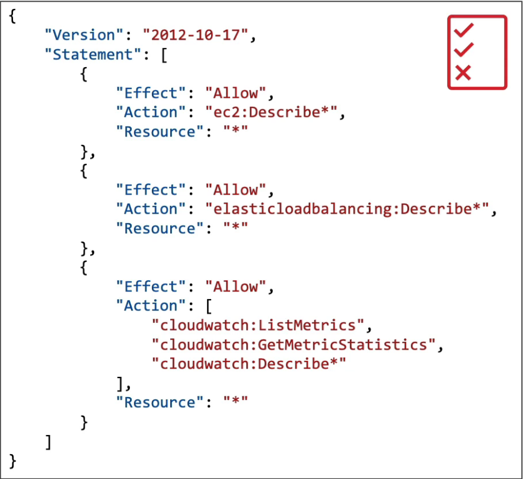

    IAM stands for identity and access management. It's a global service. In IAM we create users and assign them to groups. The root account created by default shouldn't be used.  
    Instead we should create users. After creating user, creating an account alias for the account id is also a convenience because it is hard to remember just numbers.
    Users and groups can be assigned JSON documents called policies which defines what actions users or groups are allowed to do:

    We can create policies by ourselves as well for example a password policy or any other policies specific to one or multiple services. 

    We can use multi factor authentication(MFA) in AWS to ensure that account is not compromised even password is stolen. These are the MFA device options in AWS:

        - Virtual MFA device which supports multiple tokens on a single device.
        - Universal 2nd Factor(U2F) Security Key(physical like smart card) which support multiple root and IAM users with a single security key.
        - Hardware Key Fob MFA Device
        - Hardware Key Fob MFA Device for AWS GovCloud(US)

    Access options to AWS:
        - AWS Management Console which is used from browser to sign in via password or additionaly with MFA.
        - AWS CLI which is protected by access keys.
        - AWS SDK which is for development and again protected by access keys. Example use case is calling APIs in AWS from the code or managing services programmatically.

    To make services behave in behalf of users(or us), we use IAM roles. They are like users but instead they meant to be used by AWS services not from real people.

    IAM security tools:
        - IAM credentials report: A report that lists all of our account's users and the status of their credentials
        - IAM access advisor: Shows service permissions that is granted to a user and when these service are last accessed

    

    
