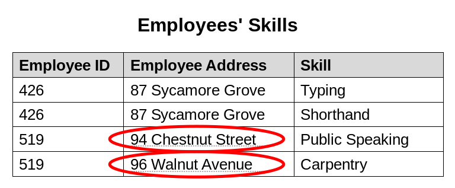
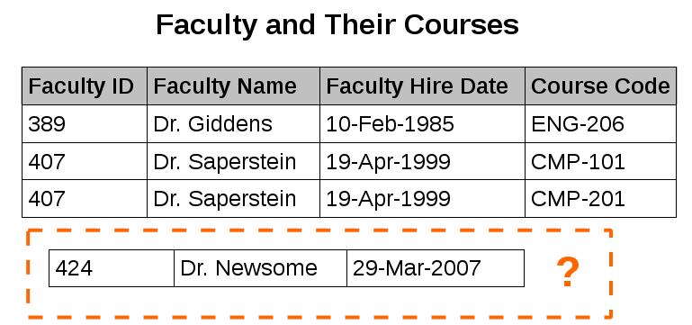

    Database normalization is structuring of relational schemas to reduce data redundancy and improve data integrity.  
    Undesirable side effects may arise in insertion, update or deletion operations if underlying relation is not sufficiently  
    normalized:

    Update anomaly: Due to lack of normalization, same information may be present on multiple rows and it can cause  
    inconsistent results after a partially successfull update operation. For example, suppose there is a Employee Skills  
    relation with columns Employee ID, Employee Address, and Skill. Because an employee may be present in multiple rows  
    a change to address of an employee may be required to apply to multiple records. In case of a partially successfull  
    update operation, addres of the employee is updated on some records but not on others and relation is left in a  
    inconsistent state. A query for the address of the employee returns conflicting answers.

    Insertion anomaly: In some circumstances, data can't be recorded at all. Suppose there is a Faculty and Their Courses  
    relation with columns Faculty ID, Faculty Name, Faculty Hire Date and Course Code. Faculties with at least one course  
    can be recorded, but for example a newly hired faculty member can't be recorded except setting Course Code to NULL.

    Deletion anomaly: In some circumstances, deletion of some data necessitates deletion of unrelevant data. For example,  
    in Faculty and Their Courses relation if a faculty member ceases to be assigned any course it requires deletion of 
    records that this faculty member appears which also means effectively deleting of faculty member and losing other data  
    about faculty member if no NULL is allowed in the Course Code column. 
