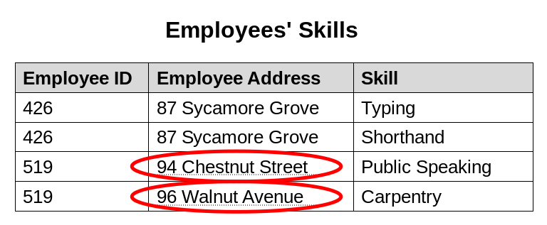
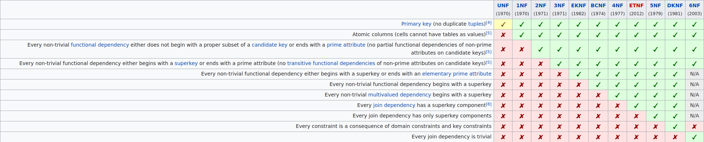
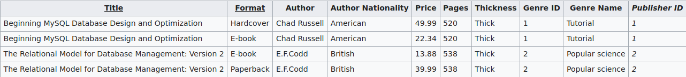
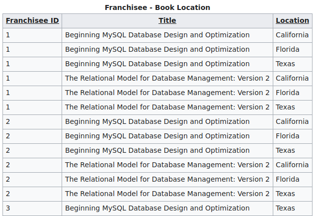
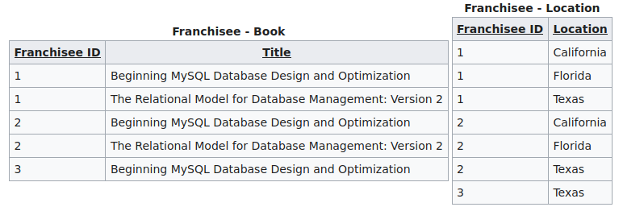

## Introduction  
    Database normalization is structuring of relational schemas to reduce data redundancy and improve data integrity.  
    Undesirable side effects may arise in insertion, update or deletion operations if underlying relation is not sufficiently  
    normalized:

    Update anomaly: Due to lack of normalization, same information may be present on multiple rows and it can cause  
    inconsistent results after a partially successfull update operation. For example, suppose there is a Employee Skills  
    relation with columns Employee ID, Employee Address, and Skill. Because an employee may be present in multiple rows  
    a change to address of an employee may be required to apply to multiple records. In case of a partially successfull  
    update operation, addres of the employee is updated on some records but not on others and relation is left in a  
    inconsistent state. A query for the address of the employee returns conflicting answers.

    Insertion anomaly: In some circumstances, data can't be recorded at all. Suppose there is a Faculty and Their Courses  
    relation with columns Faculty ID, Faculty Name, Faculty Hire Date and Course Code. Faculties with at least one course  
    can be recorded, but for example a newly hired faculty member can't be recorded except setting Course Code to NULL.

    Deletion anomaly: In some circumstances, deletion of some data necessitates deletion of unrelevant data. For example,  
    in Faculty and Their Courses relation if a faculty member ceases to be assigned any course it requires deletion of 
    records that this faculty member appears which also means effectively deleting of faculty member and losing other data  
    about faculty member if no NULL is allowed in the Course Code column. 

    Informally, if a relation meets 3NF then it is considered normalized. Most 3NF relations are free of insert, update and
    deletion anomalies.

    Normal forms from least normalized to most normalized:

  

## Example step by step normalization  
    Initial relation:

  

    First of all to conform to the relational model, a table must have a primary key which uniquely identifies each row.
    Two books could have same title but an ISBN number uniquely identifies each book, so it can be used as a primary key.

    To satisfy 1NF, each column of a table must have a single value. Columns that contains a set of values or nested records
    are not allowed. Because Subject column has a set of values in cells, it must be extracted into another table. A foreign
    key column is also added to newly created table which refers to the primary key of the row in the original table from
    which subjects are extracted:

    If a table has a single column primary key then it already satisfies 2NF, but if it is a composite primary key then it
    may not satisfy 2NF. For example consider this table with composite candidate key(it is still in design phase) that 
    consists of Title and Format columns:

    In the table all non-candidate key attributes depends on title but only price also depends on format. To conform to 2NF
    no attribute should depend on a subset of a candidate key, but they must depend on the whole candidate key. To normalize
    this table, we can use title as a simple candidate key and put price to another table to preserve its dependency on format.

    To satisfy 3NF we should remove transitive functional dependencies. In the 2NF form of the table, Author Nationality is
    dependent on Author which is dependent on Title. Similarly Genre is dependent on Genre ID which is again dependent on Title.
    To conform to 3NF we should place Author Nationality and Genre Name to their own tables:

    EKNF(elementary key normal form) falls between 3NF and BCNF to capture good sides of them and to avaoid problems due to 
    3NF is too forgiving and BCNF is prone to computational complexity. Because it is not considered too much in the literature
    it is skipped.

    Suppose book retailer is a franchise that has several franchisees that own shops at different locations and therefore the 
    retailer franchise decided to add another table that contains data regarding availability of different books at different
    locations:

    Considering it has a composite primary key and no non-key attributes and it is in BCNF form then it already conforms to 
    previous normal forms as well. However, assuming that all available books are offered at each locations then it means
    there is no unambigious(clear) relationship between Title and Location, so this table doesn't conform to 4NF. To satisfy
    4NF we should decompose it:

