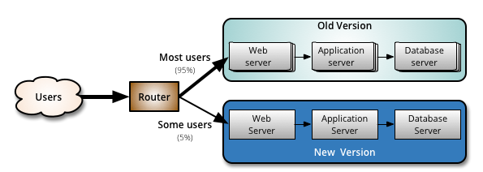

    Canary release is a deployment strategy to reduce the risk of introducing a new software version
    by gradually rolling out the change to a small subset of users before rolling it out to entire
    infrastructure and users. 

    First, new version is deployed to a subset of the infrastructure with no user access. When new
    version is decided to be good enough, a small subset of users are allowed to access it. Users
    might be sampled randomly, or internal users or users that picked based on their profile. 
    
