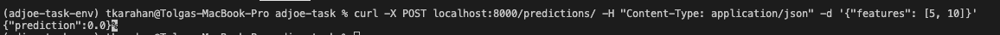
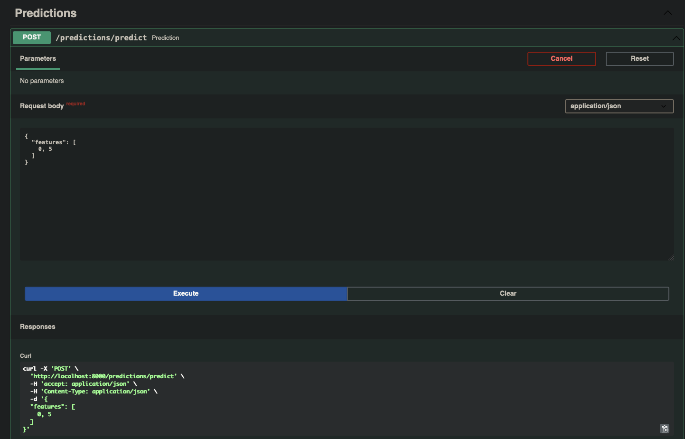
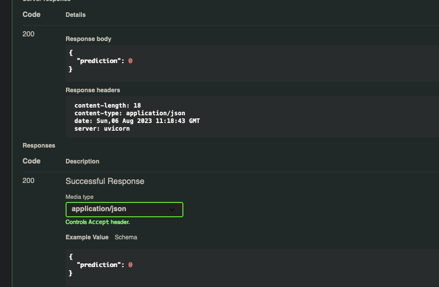
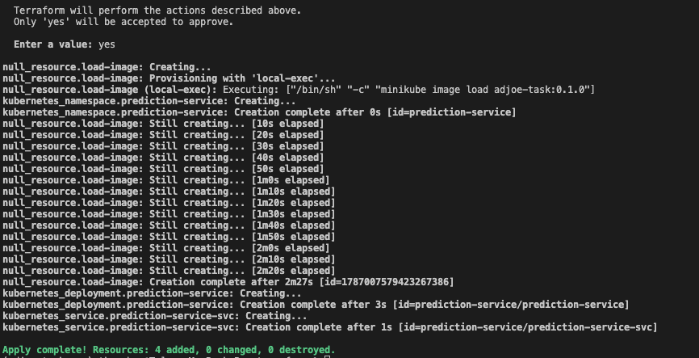

## Create Virtual Env
    conda create -n adjoe-task-env python==3.9
    pip install -r requirements.txt

## How to start API in local
Go to root directory 
Make start script executable:  
    
    chmod u+x prediction-service/start.sh

Run the script:

    ./prediction-service/start.sh

## How to make a POST request
Pydantic models are used as input/output validation schemas.    
Input format:   

    {
        "features": [5, 10]
    }

Output format:  

    {
        "prediction": 0
    }

Curl command to make a prediction:

    curl -X POST localhost:8000/predictions/ -H "Content-Type: application/json" -d '{"features": [5, 10]}'

## Validation

Pydantic doesn't validate inputs in case less or more than two values provided as features:

## Prediction via curl:

## Prediction from interactive documentation:

## Manuel Deployment
K8s objects in k8s folder can be deployed via kubectl cli tool:

    docker build -t prediction-service:0.1.0 .
    minikube start
    kubectl create namespace prediction-service
    cd k8s
    kubectl apply -f deployment.yaml -n prediction-service
    kubectl apply -f service.yaml -n prediction-service

## Deployment via Terraform
Deployment via terraform:

    docker build -t prediction-service:0.1.0 .
    minikube start
    minikube image load prediction-service:0.1.0
    cd terraform
    terraform init
    terraform plan
    terraform apply

## Running Tests
You can run tests by installing Pytest and running the command in the root of the project:

    pip install pytest
    pytest tests/
