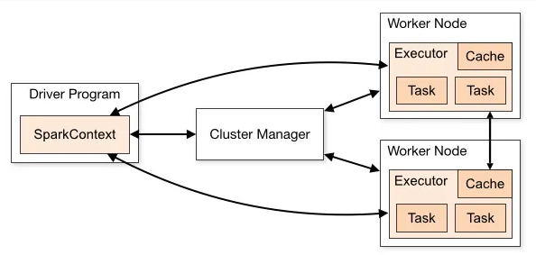

    Spark is a distributed processing engine for large scale data processing. Its prominent features are:

        - in-memory computation
        - caching
        - lazy evaluation
        - immutability
        - supports sql
        - distributed processing
        - supports multiple cluster managers(spark, yarn, mesos, ...)
        - integration to various data sources
        - streaming
        - ml modelling

    Spark works in master-slave architecture. Master is called driver and slaves are called workers. When a
    Spark application is run, Spark Driver creates a context which is an entry point, and all operations
    are executed on worker nodes while resources managed by cluster manager.

    
    
    
