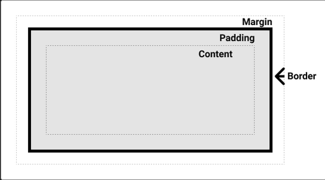
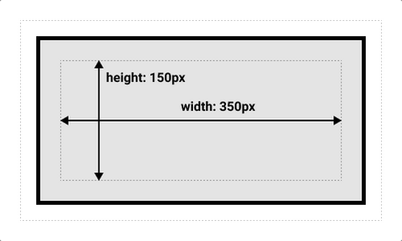
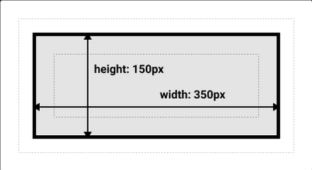

<link rel="stylesheet" href="box-model.css" type="text/css">

## The Box Model
        Everything in CSS has a box around it. There are mainly two types of boxes: block boxes and inline boxes. 

## Block and Inline Boxes
        These type distinction is based on how box behaves in terms of page flow and how
    it interacts with other boxes. By default, elements inside a box are laid out in normal
    flow and behave as block on inline boxes. Boxes also have an inner display type and outer display type. It can be set by using display property.

    1 - Outer display type
            If a box has an outer display type of block:
                - The box will break onto a new line.
                - The width and height properties are respected.
                - Padding, margin and border will cause other elements
                to be pushed away from the box.
                - The box will extend in the inline direction to fill
                the space in the container.
                - Elements such as <h1> and 
 uses block as their
                default outer display type.

            If a box has an outer display type of inline:
                - The box won't break onto a new line.
                - The width and height properties won't apply.
                - Vertical padding, margins and borders take effect,
                but they don't cause other elements to be pushed away
                from the box.
                - Horizontal padding, margins and borders take effect,
                and they cause other elements to be pushed away from 
                the box.
                - Elements such as <a>, , <em> and <strong> use
                inline as their default outer display type.

    2 - Inner display type
            Inner display type determines how elements inside the box are laid out.
        It can be changed via display property.

## Examples
        There are three block level elements in the example below. Paragraph has outer display type of block. It extends to the entire available width. List is also type of block. It means that it also extends to the entire width of the container, but in the example display of the inner elements are changed. span is an inline element, but its child can be displayed as a block element.

    Paragraphs are block elements! Take a look to its border and how it extends to full extend of its container.

<ul class="block-example">
    <li>List is also a block element. </li>
    <li>But we can change display of </li>
    <li>the child elements in the container.</li>
</ul>

span is normally an inline element. But we can change its display too!

        When display is changed to inline-flex, it doesn't just change the way child elements in the container shown, but also creates an inline container. As can be seen in the list below:

<ul class="inline-example">
    <li>Item One</li>
    <li>Item Two</li>
    <li>Item Three</li>
</ul>

A paragraph that behaves as an inline element.

Another paragraph that behaves as an inline element.

## CSS Box Model
        CSS box model applies to block boxes as a whole while it partially applies to inline boxes. It define how margin, border, padding and content work together to create a box.

        Content box is the area where the content is displayed. It can be sized by inline-size, block-size, width and height.

        Padding box is the space around the content. Sized by padding property.

        Border box wraps all the content and padding. It is configured via border and related properties.

        Margin box is the space between this box and other elements. Configured via margin and related properties.

        inline-size, block-size, width and height properties determine the size of the content. Space taken up by the box is calculated by considering padding and border in addition to content size. Margin is not counted towards the size of the box, box ends in borders. It's called standard CSS box model.

        There is also alternative CSS box model. In alternative model, width is the width of the whole visible box on the screen not just width of the content box. Content area width is calculated as width-2xborder-2xpadding.

        To use the alternative box model, box-sizing property on the html element must be border-box and all other elements must inherit it.

        html {
            box-sizing: border-box;
        }
        *,
        *::before,
        *::after {
        box-sizing: inherit;
        }
