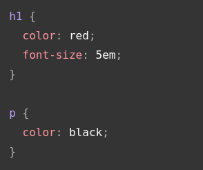

## CSS
    CSS is a rule based language to style and layout pages. Rules are consist of selectors, properties and values. such as:

## Selectors
    There are CSS selectors to grab elements for styling such as element selector, class selector, id selector so on. Element
    selector selects and HTML element and apply rules defined for it. 
    
    If we want to apply same rules to various elements then we can use class selector to give class to these elements or we
    can use id to specifically style one instance of an element.
    
    If we want to apply rules to a subset of same element then one option is using element selector and class selector together.
    For example if we want to style all list elements that have class special then we can use such a selector: li.special.
    Similar case is selecting elements under another element. To accomplish it we can use descendant combinators. For example
    to select all em elements under li elements: li em. 
    
    A different case is applying rules to elements which come after another element in the hierarchy. For example applying
    rules to paragraphs that come after a h1 in the same hierarchy: h1 + p. It is called adjacent combinator.

    Elements also can be styled based on their state. To do that we need to select elements based on their state. For example
    <a> element has different states that depend on whether link is visited or unvisited, hovered over, focused via keyboard,
    or activated. For example to style links that is visited before: a:visited.

    CSS cascade and specifity rules applies when there are multiple rules that targets same element. If specificity of the
    selectors are same, for example two p element selectors in the same file, then latest one applies which is called cascade.
    In other cases one with more specifity applies no matter where it is defined in stylesheet.

## How CSS works?
    Browsers' process of displaying documents roughly follow the steps below:
        1) Browser loads the HTML.
        2) HTML is converted into DOM which is a representation of the document in memory.
           A DOM has tree-like structure. Each element, attribute and text is a DOM node.
        3) Browser fetches resources that is linked to by HTML.
        4) Fetched CSS is parsed and rules are sorted by their selectors. Browser works out
           which rules will be applied to which node in the DOM and attaches styles to them.
           This step is called a render tree.
        5) Visual display of the page is shown on the screen.

    If there is an error in CSS, for example misspelled property or value, browser just skips it. Same happens if browser
    didn't implement latest CSS specifications.
